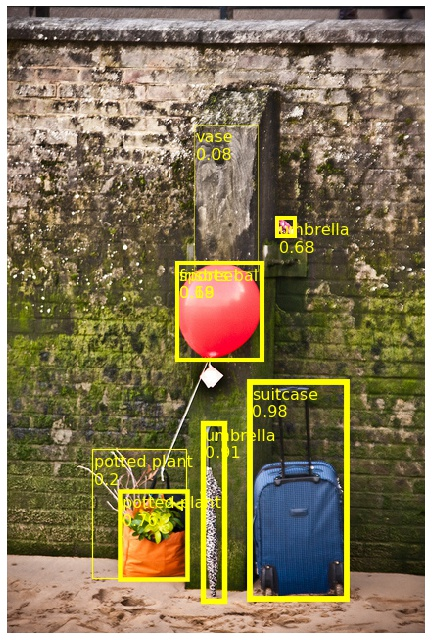
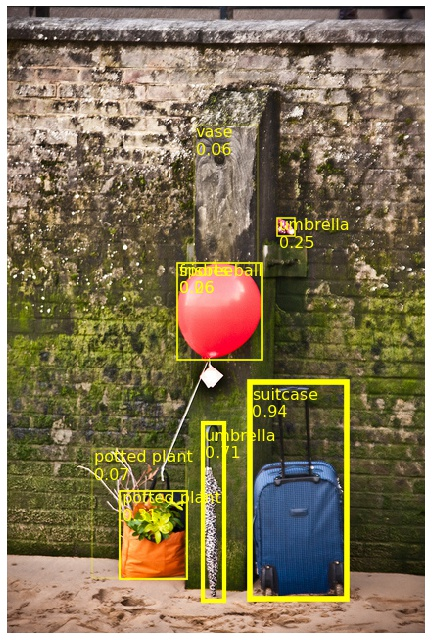
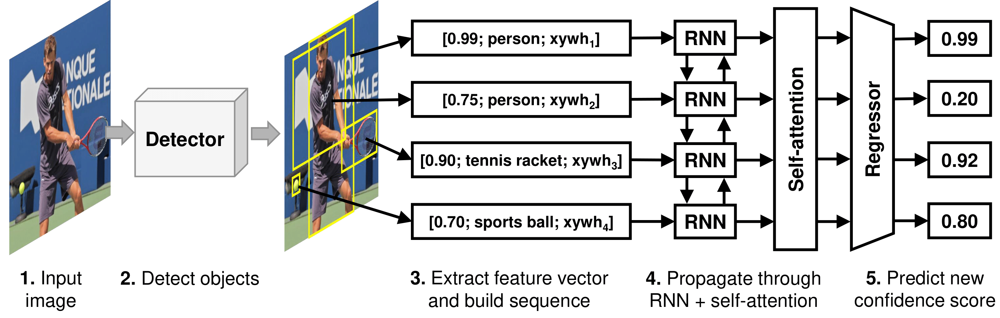

# Seeing without Looking: Contextual Rescoring of Object Detections for AP Maximization

**[[arXiv](https://arxiv.org/abs/1912.12290)]** **[[CVPR]()]**

<p align="center">
  
  
</p>

## Introduction

Seeing without Looking is an approach that aims to improve Average Precision by rescoring the object detections with the use of contextual information inferred from other objects in the same image.
The model takes in a set of already made detections and predicts a new score for each object. 

Because our approach does not use any visual information, contextual rescoring is **widely applicable** and **inference is fast**.

<p align="center">
  
</p>

### Results

| Detector*               | `val2017` AP                      | `test-dev2017` AP                 | inf time (fps)** |   Download   |
| :---------------------: | :-------------------------------: | :-------------------------------: | :--------------: | :----------: |
| RetinaNet R-50-FPN      | 35.6 &rightarrow; 36.6 **(+1.0)** | 35.9 &rightarrow; 36.8 **(+0.9)** |  93.5            | [model](https://www.dropbox.com/s/ce6dodofd5nu9d8/retina50.zip) / [detections](https://www.dropbox.com/s/sveqxg1ye5h8ukd/detections_retinanet50.zip) / [rescored](https://www.dropbox.com/s/264q2a7pkly8paq/rescored_retina50.zip) |
| RetinaNet R-101-FPN     | 38.1 &rightarrow; 38.7 **(+0.6)** | 38.7 &rightarrow; 39.2 **(+0.5)** |  110.4           | [model](https://www.dropbox.com/s/lflggma9sffvfc7/retina101.zip) / [detections](https://www.dropbox.com/s/1nkd49iu0cebo56/detections_retinanet101.zip) / [rescored](https://www.dropbox.com/s/777v79c8ja9epw2/rescored_retina101.zip) |
| Faster R-CNN R-50-FPN   | 36.4 &rightarrow; 37.5 **(+1.1)** | 36.7 &rightarrow; 37.5 **(+0.8)** |  196.1           | [model](https://www.dropbox.com/s/dwbej7i8nqaxfza/faster50.zip) / [detections](https://www.dropbox.com/s/a0dlb4hutduaobl/detections_faster50.zip) / [rescored](https://www.dropbox.com/s/g0y09zwoifzywj1/rescored_faster50.zip) |
| Faster R-CNN R-101-FPN  | 39.4 &rightarrow; 39.9 **(+0.5)** | 39.7 &rightarrow; 40.1 **(+0.4)** |  255.7           | [model](https://www.dropbox.com/s/z9xi2j0x1aujhxi/faster101.zip) / [detections](https://www.dropbox.com/s/vkubqbi6vrzflt6/detections_faster101.zip) / [rescored](https://www.dropbox.com/s/dtypwphno8ah03h/rescored_faster101.zip) |
| Cascade R-CNN R-50-FPN  | 41.1 &rightarrow; 41.8 **(+0.7)** | 41.5 &rightarrow; 42.0 **(+0.5)** |  306.1           | [model](https://www.dropbox.com/s/eqnzinsqzobcitr/cascade50.zip) / [detections](https://www.dropbox.com/s/6ncbn876vs3hrom/detections_cascade50.zip) / [rescored](https://www.dropbox.com/s/j712snfffpgkjmu/rescored_cascade50.zip) |
| Cascade R-CNN R-101-FPN | 42.1 &rightarrow; 42.8 **(+0.7)** | 42.4 &rightarrow; 42.8 **(+0.4)** |  297.1           | [model](https://www.dropbox.com/s/njv5jpi6bfvk0qq/cascade101.zip) / [detections](https://www.dropbox.com/s/9sdg9riao2806ar/detections_cascade101.zip) / [rescored](https://www.dropbox.com/s/und4ijnoi41rns5/rescored_cascade101.zip) |

*baseline detections were generated using Open MMLab [MMDetection](https://github.com/open-mmlab/mmdetection/) implementations from [MODEL_ZOO](https://github.com/open-mmlab/mmdetection/blob/master/docs/MODEL_ZOO.md)

**approximate inference time during evaluation

## 1. Getting started

**1.1.** Clone git repo
```
git clone https://github.com/LourencoVazPato/seeing-without-looking.git
```

**1.2.** Install requirements
```
pip install -r requirements.txt
```

**1.3.** Download annotation files and create useful folders
```
bash tools/setup.sh
```

## 2. Usage instructions

### 2.1. Generating detections

Input detections must be generated using any detection architecture of your choosing and saved in a JSON file with the official [COCO results format](http://cocodataset.org/#format-results). 
<!-- ```
[{
    "image_id"      : int, 
    "category_id"   : int, 
    "bbox"          : [x,y,width,height], 
    "score"         : float,
}]
``` -->
The generated detections must be saved under `data/detections/detections_<dataset>_<architecture>.json`, where `<architecture>` is the name of the model you have used for generating the detections and `<dataset>` refers to either `train2017`, `val2017` or `test-dev2017` splits of the COCO dataset. 

You can measure the baseline AP on `val2017` by running:
```
python tools/coco_eval.py data/detections_<dataset>_<architecture>.json data/annotations/instances_val2017.json
```

### 2.2. Preprocessing detections

The detections must be preprocessed and saved into disk to save time during training. For that, run:
```
python preprocessing.py <dataset> <architecture>
```
Run this command for all datasets: `train2017`, `val2017`, and `test-dev2017`. 
The preprocessed tensors will be saved to `data/preprocessed/preprocessed_<dataset>_<architecture>.pt`.

### 2.3. Training the model

Once the detections have been preprocessed, you can train a model by running:
```
python train.py <config_file> <architecture>
```
Once training is completed, the training logs, model parameters and model config should be saved to `logs/<config_file>/`.
Note that the logs will override the contents of `logs/<config_file>/`. A config file must be created under a different name for different architectures.

### 2.4. Evaluating model (with preprocessed detections)
```
python evaluate.py <config_file> <path_preprocessed>
```

If the preprocessed detections belong to `val2017`, the rescored results will be saved in `temp/val_results.json` and the validation AP is computed.

If the preprocessed detections belong to test-dev2017 set, the rescored results will be saved in `temp/detections_test-dev2017_<config>_rescored_results.json` and can be zipped and submitted for evaluation on [CodaLab](https://competitions.codalab.org/competitions/20794#participate).

### 2.5. Performing inference (without preprocessed detections)

Once you have a trained model you can perform inference on the detections without preprocessing by running:
```
python inference.py <config> <model> <path_dets> <path_anns>
```
Where `<config>` is the model config file, `<model>` is the model's weights file in `.pt` format, `<path_dets>` is the detections JSON file and `<path_anns>` is the annotations file (`data/annotations/instances_test-dev2017.json`). 

We recommend using method 4 (with preprocessed detections) for official evaluation results as it yields slightly better scores.


## 3. Example usage with Cascade R-CNN

### 3.0. Download detections for Cascade R-CNN R-101
Altenatively, you can generate the detections on your own.
```
cd data/detections
wget https://www.dropbox.com/s/9sdg9riao2806ar/detections_cascade101.zip
unzip detections_cascade101.zip
rm detections_cascade101.zip
```

### 3.1. Pre-process detections
```
python preprocessing.py val2017 cascade101
python preprocessing.py test-dev2017 cascade101
python preprocessing.py train2017 cascade101
```

### 3.2. Train model
```
python train.py configs/cascade101.json cascade101
```

### 3.3. Evaluate model on `val2017`
```
python evaluate.py logs/cascade101/params.json data/preprocessed/preprocessed_val2017_cascade101.pt
```
The rescored results will be saved to `temp/val_results.json`

### 3.4. Evaluate model on `test-dev2017`
```
python evaluate.py logs/cascade101/params.json data/preprocessed/preprocessed_test-dev2017_cascade101.pt
```
The rescored results will be saved to `temp/detections_test-dev2017_cascade101_rescored_results.json`


## 4. Fast Usage (download trained model and rescore detections)

**4.0.** Generate detections using your own detector.
Or download raw detections. If you haven't run 3.0., then run:
```
cd data/detections
wget https://www.dropbox.com/s/rx43xlc90vril99/detections_val2017_cascade101.json
cd ../..
```

**4.1.** Download trained model.

```
cd logs
wget https://www.dropbox.com/s/njv5jpi6bfvk0qq/cascade101.zip
unzip cascade101.zip
rm cascade101.zip
cd ..
```

**4.2.** Perform inference
```
python inference.py logs/cascade101/params.json logs/cascade101/model.pt data/detections/detections_val2017_cascade101.json data/annotations/instances_val2017.json
```


## Citation
```
@article{pato2019seeing,
  title={Seeing without Looking: Contextual Rescoring of Object Detections for AP Maximization},
  author={Pato, Lourenço V. and Negrinho, Renato and Aguiar, Pedro M. Q.},
  journal={CVPR},
  year={2020}
}
```
